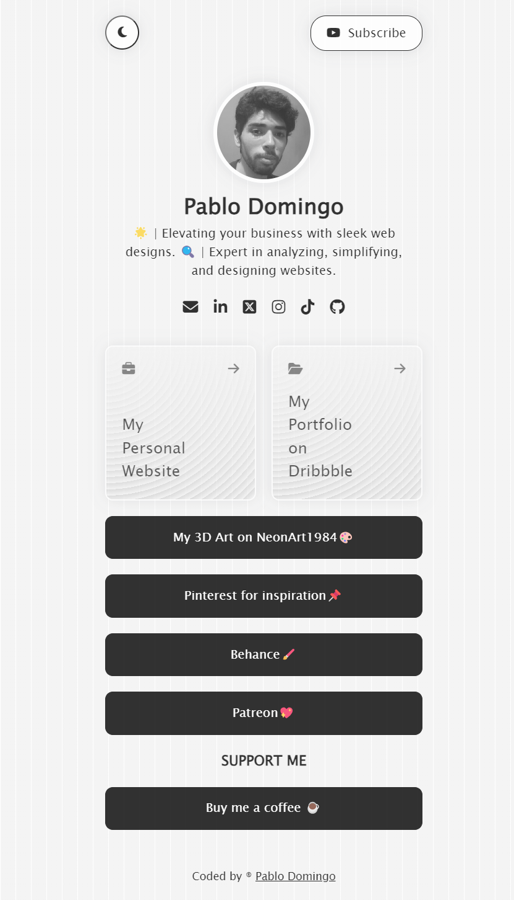
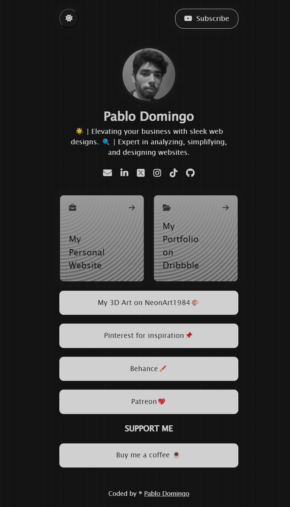

# Minimalist Bio Link Web

## Project Description
This project is a minimalist bio link page designed to showcase various links related to Pablo Domingo's work, including social media profiles and personal projects. The design is clean and modern, supporting both light and dark modes.

## Features
- Light and Dark mode toggle
- Responsive design
- Links to social media and personal projects
- Simple and clean interface

## Technologies Used
- HTML
- CSS
- JavaScript
- Font Awesome for icons

### Light Mode


### Dark Mode



## Installation
To set up this project locally, follow these steps:
1. Clone the repository:
   ```bash
   git clone https://github.com/yourusername/your-repo.git
